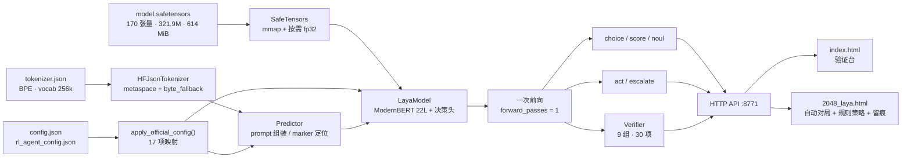

# Laya 决策模型 · 本地验证台

> 一份**没有配套 modeling 代码**的 `model.safetensors`，本项目从张量形状反推架构、用纯 numpy 重建前向，
> 把它真正跑起来，并给出**可判定**的验证报告 —— 而不是一句"看起来能跑"。


---

> [!IMPORTANT]
> **当前状态：管线已连通，语义决策通道尚未对齐。**
> 词表（官方 `tokenizer.json`）与全部架构参数都已对齐，验证报告 **0 FAIL**；
> 但平凡可判定探针只命中 2/3、选项间 logit 极差仅 `5.04e-03`，故语义项判 **BLOCKED**。
> 这意味着本仓库当前的输出可信度仅限于「**链路闭环 + 全程留痕**」，
> **任何"准确率"读数都不可解释**（不是模型差，是决策头增益不足）。
> 详情见 [已知限制](#已知限制)。

---

## 这是什么

`model.safetensors` 是 `jhu-clsp/mmBERT-base`（ModernBERT 风格编码器）外挂一个自训练决策头的
**非自回归 System-1 决策模型**：给它一段 `state` 和若干 typed question，它在一次前向里
为**每个选项**在 `<mask>` 位置打分，直接产出离散决策。

配套的 modeling 代码不在手上，权重里也没有 `prompt 模板`、`type_emb 注入位置`、
`head 读出位置` 这些只能靠猜的信息。本项目做两件事：

1. **反推 + 重建**：只读 safetensors 头与张量形状，用 numpy 重写出可执行前向 —— 不依赖
   `torch` / `transformers`，权重按需 mmap 转 fp32，CPU 上即可跑。
2. **验证 + 判定**：把"我知道什么""我猜了什么""哪一项还没对齐"拆开，做成 30 项自检、
   9 个分组，每项带判别量，并把所有反推假设显式列在 UI 与 API 里。

## 特性

- **零重依赖**：第三方依赖只有 `numpy`。safetensors 由约 80 行自研读取器（`mmap` + 按需转 fp32 + 引用计数缓存）实现。
- **官方配置自动对齐**：同目录存在 `config.json` / `rl_agent_config.json` 时自动读取覆盖默认值 —— **17 项映射**，其中 11 项 `applied`、5 项标为 `unmodeled` 单独列出，避免把"猜的"当成"知道的"。
- **一次前向回答全部问题**：`meta.forward_passes = 1`。加问题不加前向次数，只加序列长度 —— 这决定了 2048 页那类高频调用怎么设计才划算。
- **typed questions**：`choice`（多选一）/ `score`（有序档位，返回期望值）/ `noul`（概率），三种 primitive 各有独立温度下标。
- **诚实的验证报告**：良构性检查与语义检查分离；判不出结论时输出 `BLOCKED` 并写明"为什么判不出"，而不是给一个看起来通过的 PASS。
- **两个前端**：验证台（`index.html`，由后端直接服务）与 2048 自动对局页（`2048_laya.html`，含规则策略、抉择历史留痕与 JSONL 导出）。
- **可复现**：2048 页使用 mulberry32 + FNV-1a 播种，同一 seed 棋盘序列完全一致。

## 架构



### 从权重反推出的结构（逐项有依据）

| 组件 | 实测 / 依据 |
|---|---|
| 编码器 | ModernBERT 风格，**22 层**，hidden **768**，**12** 头，GeGLU `inter=1152`，`vocab=256000` |
| 位置编码 | RoPE（权重中**不存在** `position_embeddings` 张量即证据），`rope_theta = 160000` |
| 注意力调度 | 每 3 层 1 层 full + 其余 sliding（`local_attention=128` → 半径 64），取自官方 `layer_types` |
| 归一化 | encoder `eps=1e-5` **无 bias**；head 各 norm **带 bias** |
| 决策头 | 2 层 transformer · `scorer: 768→768→768→1`（index 2 为激活位）· `act_head: 768+4→256→2` |
| 架构指纹 | `encoder.layers.0` **不含** `attn_norm.weight` —— 对应 HF 的 `attn_norm = Identity() if layer_id == 0`，独立佐证了「ModernBERT 编码器 + 自定义决策头」的判定 |
| 温度 | 权重内 `temperature = [1.0, 1.0, 1.0]` → **未做温度拟合**，与模型卡「ships over-confident」一致 |

### prompt 布局

无模板文件，按模型卡语义重建；选项通过追加 `<mask>` 实现"每选项独立打分"：

```
<bos> <state tokens> <eos>
      [ Question: <instructions> <eos>  <option text> <mask>  … <eos> ] × N
```

每个 primitive 的答案 = 该 primitive 全部选项的 `<mask>` 位置 logits，一次前向全部取出。
实测一次 `move / crowding / merge_now` 三问（157 tokens、9 个 marker）：**117 ms**，`forward_passes = 1`。

## 快速开始

**环境要求**：Python 3.8+（实测 3.13.5）、`numpy`（实测 2.4.6）。无需 `torch` / `transformers`。

```bash
cd /path/to/jev            # 本仓库根目录

# 权重不入库（见 .gitignore），放到脚本同级目录：
#   model.safetensors      ← 614 MiB
#   tokenizer.json         ← 官方 256k BPE（已在库内）
#   config.json / rl_agent_config.json / tokenizer_config.json  ← 已在库内

python3 -m pip install numpy
python3 laya_verify.py                    # 默认 127.0.0.1:8771
```

然后打开 <http://127.0.0.1:8771/> 即为验证台。加 `--open` 让它自动开浏览器。

> 缺少 `tokenizer.json` 时会退回**字节级兜底词表**（`faithful = false`）：前向仍可执行、
> 但 token→语义映射失效，此时所有语义结论自动降级为 `BLOCKED`。把官方 `tokenizer.json`
> 放进同目录重启即可切回真实语义模式。

## 使用

### CLI

```bash
python3 laya_verify.py --selftest     # 打印完整验证报告后退出（约 25 s）
python3 laya_verify.py --demo         # CLI 跑模型卡示例（打印一份完整 JSON，用于接进别的脚本）
python3 laya_verify.py --port 9000 --host 0.0.0.0 --open
```

| 参数 | 默认值 | 说明 |
|---|---|---|
| `--model` | `<脚本目录>/model.safetensors` | 权重路径 |
| `--port` | `8771` | 监听端口 |
| `--host` | `127.0.0.1` | 监听地址 |
| `--selftest` | — | 打印验证报告后退出 |
| `--demo` | — | 跑模型卡示例并以 JSON 输出 |
| `--open` | — | 启动后打开浏览器 |

### 验证台 · `index.html`

由后端在 `/` 直接服务。左侧编辑 `state` 与 typed questions，右侧上方是常驻的「④ 结果」面板，
下方五个 Tab：

- **验证报告** — 运行 30 项自检（分组见下）；
- **Token 预览** — 实际喂进模型的 token 序列、marker 位置与请求体（理解评分机制的关键，也是排查分词问题的第一现场）；
- **延迟基准** — 1 / 5 / 10 问题的延迟曲线；
- **推断项** — 8 条反推假设及其"为什么这样猜"；
- **权重台账** — 170 个张量的绑定情况。

配置区可在 UI 覆盖 `max_len / attention / mlp_gate / head_act / type_emb 注入阶段 / 温度模式`，
用于做单变量消融。

### 2048 自动对局 · `2048_laya.html`

直接双击打开（`file://` 直连 `127.0.0.1:8771`；后端已开 CORS）。

**三种决策策略**（页面「决策策略」下拉）：

| 策略 | 判决来源 | 需要后端 | 说明 |
|---|---|---|---|
| `rule` **默认** | 规则 · 期望搜索 | 否 | 规则在本机跑，后端不可用时也能玩；棋力最高 |
| `mix` | 规则主 + 模型破平 | 是 | 规则先按「存活硬门 + 2% 价值带」筛出候选，模型只能在候选内破平 |
| `model` | 模型原样 | 是 | 原始行为，用于对照 |

#### 规则策略的判决优先级

按用户目标「**优先存活 → 优先合并更多的可合并数字 → 保持更多可选空间 → 突破 2048**」实现为三级：

1. **存活**（硬门）—— 对每个合法方向，枚举其后的随机 spawn（2 占 90% / 4 占 10%），
   统计「spawn 后立刻无路可走」的概率 `deadRisk`。**只要存在 `deadRisk == 0` 的方向，
   就只在其中选**。实测 5 局全历史中「存在零风险方向却选了有风险方向」的次数为 **0**。
2. **期望搜索价值** —— 对落子后的盘面做期望极大搜索（expectimax，`depth` 可选 1/2/3 层）。
   局面评估对每条线（4 行 + 4 列）算：

   | 项 | 权重 | 对应的目标 |
   |---|---|---|
   | 相邻同值对数 `merges` | `+700` | 优先合并更多的可合并数字 |
   | 空格数 `empty` | `+270` | 保持更多可选空间 |
   | 单调性（贴边成序） | `−47` | 结构性 |
   | 面值和 `Σrank^3.5` | `−11` | 抑制大块独大，保住灵活性 |
   | 最大方块守角 | `+150·log₂(v)` | 突破 2048 的结构 |
   | 死局 | `−1e7` | 优先存活 |

3. **同档破平** —— 在最优值 **2%** 的价值带内，按「合并数 → 空格数」择优。

> 为什么带宽这么窄：**24 局配对实测**，窄带择优比严格取最优好但**不显著**
> （band 0.02 / 0.05 / 0.15 分别 +3 253 / +1 791 / +1 843 分，SE ±4.9k~5.4k）；
> 而一旦把带宽放到 **≥50%**（让「合并多」压倒搜索价值）就**显著变差**
> （−12 869 分，SE ±3 630，胜/负 8/16）。结论：合并与空间只能当破平项，不能凌驾于搜索价值之上。
> 另外 `prefer=space` 与 `prefer=merge` 在同一批 24 个种子上判决**逐位相同**（分歧 0/2 120 步）——
> 「合并多」通常也就「释放格子多」，所以 UI 上只保留「合并·空间优先」一个选项（引擎里仍保留
> `space` 比较器供复测）。

#### 抉择历史（每条留痕）

步号、应用方向、判决来源、**模型与规则是否一致**、合法性/回退徽章、得分增量、新方块、
移动前后两张 4×4 缩略棋盘、模型四方向概率条、**规则四方向分解**
（相对价值 / 立即合并数 / 移动后空格数 / 死亡风险，选中方向高亮、有风险方向标红）、
`score` 变化、每步合并数、规则耗时、tokens 与模型延迟。

支持「仅异常」筛选（回退 / 终局 / 与规则分歧）、`导出 JSONL`（`model` 段在纯规则模式下为 `null`）与一键复制。

#### 统计面板

分两组。**对局**：对局数 / 总步数 / 最高分 / 最大方块 / 达成 2048 局数 /
平均每步合并 / 平均剩余空格 / 平均延迟。**决策通道**：规则·模型一致率 / 回退率 /
merge 判断命中 / crowding 命中 / 平均 max p / 平均 logit 极差。

#### 实测棋力（同一批 **24** 个种子，depth=2）

| 规则偏好（带宽） | 均分 | 中位数 | 最低 | 最高 | 2048 达成 | 峰值方块 | 与均衡的配对差 |
|---|---|---|---|---|---|---|---|
| 均衡（band=0，严格取最优） | 33 581 | 32 784 | 5 392 | 75 804 | 18/24 | 4 096 | — |
| **合并·空间优先（band=0.02，默认）** | **36 834** | 36 032 | 14 716 | 69 212 | **21/24** | 4 096 | +3 253（SE ±5 031，不显著） |
| 合并优先（band=0.05） | 35 372 | 36 468 | 4 204 | 78 668 | 17/24 | 4 096 | +1 791（SE ±5 412，不显著） |
| 合并优先（band=0.15） | 35 424 | 33 844 | 6 560 | 72 060 | 19/24 | 4 096 | +1 843（SE ±4 859，不显著） |
| 合并优先（band=0.50） | 20 711 | 17 424 | 5 720 | 40 184 | 11/24 | 2 048 | **−12 869（SE ±3 630，显著）** |
| 合并优先（band=1.00） | 20 253 | 15 984 | 5 696 | 54 128 | 8/24 | 4 096 | **−13 327（SE ±4 482，显著）** |
| 随机基线（对照） | 1 339 | 1 376 | — | 2 344 | 0/8 | 256 | — |

单步耗时：depth=2 平均 **2.97 ms**（可交互）；depth=3 平均 **640 ms**（开局 1 137 ms，仅供离线追分）。
死亡归因：抽检 5 局全历史，「存在零风险方向却选了有风险方向」的次数为 **0** —— 每局都只在
「零风险方向数 = 0」时才死。

模型照旧每步发一次 `POST /api/predict`（可在「规则模式下仍调用模型」取消），**一次前向同时回答 3 个 typed question**：

| question | 类型 | 作用 |
|---|---|---|
| `move` | `choice` | 走哪一步 —— 通道诊断的读数来源 |
| `crowding` | `score` | 拥挤度探针（与真值比对） |
| `merge_available` | `noul` | 能否合并探针（与真值比对） |

模型给出**非法方向**时回退到规则判决，并在留痕上标 `fallback: true`。

## HTTP API

| 方法 | 路径 | 说明 |
|---|---|---|
| `GET` | `/` · `/index.html` | 验证台页面 |
| `GET` | `/api/health` | `{"ok": true}` |
| `GET` | `/api/status` | 权重 / 词表 / 生效配置 / **官方配置对齐明细** / 预置样例 / 推断假设 |
| `POST` | `/api/predict` | 一次前向，回答全部 typed questions |
| `POST` | `/api/verify` | 运行 30 项自检并返回报告 |

`POST /api/predict` 请求：

```json
{
  "state": "game: 2048 (4x4)\nscore: 32\nempty cells: 11\nmax tile: 8\nboard rows (top to bottom, 0 = empty):\n2 0 0 2\n0 4 0 0\n0 0 8 0\n0 0 0 4",
  "questions": [
    { "id": "move", "type": "choice",
      "instructions": "Which move maximizes the score?",
      "criteria": { "up": "slide and merge upward", "down": "slide and merge downward",
                    "left": "slide and merge leftward", "right": "slide and merge rightward" } },
    { "id": "crowding", "type": "score",
      "instructions": "How full is this board?",
      "criteria": ["ample space", "getting tight", "almost blocked"] },
    { "id": "merge_now", "type": "noul",
      "instructions": "Can a merge be made right now?" }
  ],
  "config": { "temperature_mode": "manual", "temperature_manual": [1.0, 1.0, 1.0] }
}
```

`state` 也可以是对象（会渲染成 `k: v` 逐行）；`config` 可选，覆盖生效配置。

响应（实测，为节省篇幅只保留关键字段）：

```json
{
  "ok": true,
  "result": {
    "answers": {
      "move":      { "type": "choice", "choice": "left", "confidence": 0.253106,
                     "probs": { "up": 0.247139, "down": 0.247249, "left": 0.253106, "right": 0.252505 },
                     "ranking": [{ "key": "left", "p": 0.253106 }, "…"],
                     "logits": { "up": 0.627, "down": 0.6274, "left": 0.6508, "right": 0.6484 },
                     "logit_spread": 0.02386, "logit_absmean": 0.638414, "temperature": 1.0 },
      "crowding":  { "type": "score", "score": 1.0041, "max": 2.0, "argmax_level": 2,
                     "probs": [0.331308, 0.333247, 0.335444], "entropy_norm": 0.999988 },
      "merge_now": { "type": "noul", "noul": 0.499355, "p_no": 0.500645, "temperature": 1.0 }
    },
    "act": { "act": 1.0, "escalate": 0.0 },
    "routing": { "model": "multilingual", "script": "latin", "script_ratios": { "latin": 1.0 } },
    "meta": { "tokens": 157, "truncated": false, "n_questions": 3, "n_markers": 9,
              "latency_ms": 117.01, "ms_per_question": 39.0, "forward_passes": 1,
              "tokenizer": "tokenizer.json/BPE", "tokenizer_faithful": true,
              "attention": "alternating3",
              "health": { "has_nan": false, "has_inf": false } },
    "prompt": { "preview": "<bos> game: 2048 (4x4)<eos> Question: …",
                "spans": ["…每问的选项与 token 数…"], "tokens_per_option": 8.33 }
  }
}
```

字段语义要点：

- `choice.confidence` = 最高选项概率；`ranking` 已按概率降序排序；`logit_spread` 是**通道增益的直接读数** —— 字面可判定任务上若只有 `1e-3` 量级，说明 head 几乎没读到 marker 的上下文。上例 `0.0239` 仍属偏低的量级。
- `score.score` 是档位上的**期望值**（`argmax_level` 为众数档），`entropy_norm ∈ [0,1]`，`≈1` 表示"没形成意见"。
- `noul.noul` 是 yes 的概率。
- `meta.truncated` 为真表示 `state` 被 `max_len` 截断；`forward_passes` 恒为 1。

## 验证报告

`--selftest` 或 `POST /api/verify` 输出 30 项、9 组：

| 分组 | 内容 | 为什么值得单列 |
|---|---|---|
| `checkpoint` | 张量总数 / dtype 分布 / 词表维度一致性 / 层数 / 权重绑定覆盖率 | 绑定覆盖率能抓出"权重有、实现没用"的静默遗漏 |
| `architecture` | ModernBERT 指纹、权重内温度实测值 | 用架构指纹做独立佐证，而不是只信模型卡自述 |
| `official` | 与官方 `config.json` / `rl_agent_config.json` 的 17 项对齐；`unmodeled` 单独列出 | **真正的不确定项在这里**，任何准确率结论都必须先排除它们 |
| `forward` | 无 NaN/Inf、`Σp = 1`、marker 数 = 选项数、一次前向回答全部问题 | 数值健康与形状契约 |
| `invariants` | 确定性（同输入两次前向）、温度单调性、`local == global` 等价性 | 短序列下两种注意力必须**严格**等价，超出半径才允许分叉 |
| `tokenizer` | 词表保真度、`encode→decode` 往返 + 空格标记与单字符占比 | 见下方「分词陷阱」 |
| `channel` | **平凡可判定探针** | 通道对齐与否的判定入口 |
| `semantic` | 模型卡示例语义对比（`expect` 逐项） | 语义精度的最终读数 |
| `perf` | 延迟基准（1 / 5 / 10 问题） | CPU numpy 数值，与模型卡的 T4 数据不可直接对比 |

**当前实测结果**：`30 项 = 26 PASS / 2 WARN / 1 BLOCKED / 1 INFO / 0 FAIL`。

### 关于「官方词表让准确度下降」

结论是**不成立**：原字节兜底模式下同样没有信号可降。三臂受控实验（同一份权重、同一批 120 个局面，
只换 token 几何）显示：

| 指标 | A 字节兜底 | B 官方词表 | Δ | 判定 |
|---|---|---|---|---|
| 合法方向率 | 65.8% ±4.3 | 63.3% ±4.4 | −2.5pp（差 SE ±6.2） | 不显著 |
| merge 命中 | 55.0% ±4.5 | 45.0% ±4.5 | −10.0pp | 不显著 |
| crowding 命中 | 32.5% ±4.3 | 25.8% ±4.0 | −6.7pp | 不显著 |

真正的机制是：在**近均匀分布**下 argmax 由 prompt 的 token 几何（位置/长度）决定，而非由棋盘决定。
实测某一臂 `maxP = 0.2505`、熵 `= 1.0000`（数学上完美均匀）却 **97.5% 选择同一个方向** ——
这只能是 `~1e-3` 级系统性偏置的产物，而偏置方向随词表/序列长度翻转。
**所以任何 ad-hoc 指标（单局得分、merge 命中率）都会 ±10~20pp 乱摆**，
小样本下的"下降"就是这个摆动的负半周。

## 已知限制

1. **决策通道未对齐（当前最重要的限制）**。词表与架构参数全部对齐、`0 FAIL`，
   但平凡探针只命中 2/3、`logit_spread ≤ 5.04e-03`。三个候选根因都无法从权重确定：
   **prompt 模板**、**`type_emb` 注入位置**、**head 读出位置**。
   `rl_agent_config.json` 里的 `max_prefixes: 6` 是现存的唯一线索。
   → 在此之前，请把本仓库当作**推理重建与验证工具**，不要当作模型能力评测。
   **注意区分**：`2048_laya.html` 的默认策略是**规则（期望搜索）**，与模型通道无关；
   模型只在那里扮演留痕对照（「规则·模型一致率」应接近随机基线 25%）。
2. **未建模字段**：`max_prefixes=6`、`act_costs.escalate=0.5`、`cost_wrong_act=3.0`、
   `amp_dtype=bf16`、`temperature_by_options={}` —— 官方声明但重建实现里没有对应概念，
   报告中单独列为 `unmodeled`。
3. **温度未拟合**：权重内 `temperature = [1,1,1]`。模型卡声明 over-confident（需自行 refit），
   本项目的 `temperature` 默认取 `checkpoint`，不代替你完成校准。
4. **CPU only**：`numpy fp32`，无 GPU 后端。模型卡的延迟数字是 T4 GPU 的，不可直接对比。
5. **配置有状态**：`POST /api/predict` 若带 `config`，会**持久覆盖**服务端生效配置（供消融实验用）。
   需要干净基线时重启服务，或显式传回默认值。
6. **外部交叉验证缺失**：环境无外网，无法 `pip install tokenizers` 做逐 token 对照。
   改用**结构性不变量**核验 BPE（见下），但这是替代方案而非等价方案。

### 分词陷阱（踩过并已修）

原实现硬编码 GPT-2 的 `Ġ` 空格约定，而 `tokenizer.json` 自己声明的是 `Metaspace(▁)`：

| | 修复前 | 修复后 |
|---|---|---|
| 同一句 token 数 | **133** | **13** |
| 单字符 token | **101** | 6 |
| 空格标记 | `Ġ` 45 个 / `▁` **0** 个 | `▁` 7 个 / `Ġ` 0 个 |
| 实测序列 | `['2','0','4','8','Ġ','game',…]` | `['▁Duplicate','▁charge','▁on','▁invoice',…]` |

它有一个阴险之处：**`encode → decode` 往返完全一致**，所以自带的往返检查发现不了 ——
编码器与解码器用了同一套错约定，闭环自洽。必须**直接打印 token 字符串**才能发现。

修复后改用结构性不变量核验：输出序列必须"无法再合并"（不存在 rank 的相邻对）、无 `unk`、
无 OOV、幂等、多实例一致 —— 全部通过。换行处理也按规范核实：`'\n'` / `'\n\n'` 是
`added_tokens`（共 249 个），所以**先切分、再各自补 `▁`**，`Hello\nWorld → ['▁Hello','\n','▁World']`。

## 项目结构

```
jev/
├── laya_verify.py          # 全部实现：~1960 行单文件，11 个分节
├── index.html              # 验证台（~640 行，由后端在 / 直接服务）
├── 2048_laya.html          # 2048 自动对局 + 规则策略 + 抉择留痕（~1170 行，file:// 直连 8771）
├── model.safetensors       # 权重 614 MiB（.gitignore 排除，需自备）
├── tokenizer.json          # 官方 BPE 词表 256k（34 MB）
├── tokenizer_config.json   # 含 <start_of_turn> / <end_of_turn>（Gemma 系词表特征）
├── config.json             # 官方编码器配置（ModernBertForMaskedLM，stock）
├── rl_agent_config.json    # 真实 agent 配置：encoder / head_layers / max_prefixes / act_costs
└── .gitignore
```

`laya_verify.py` 的分节：

```
0.  推断配置 + apply_official_config()   官方配置自动对齐
1.  SafeTensors                          mmap + 按需 fp32
2.  detect_script() / route()            脚本检测与路由（<0.5 ms）
3.  Tokenizer 可插拔三层                  Base / ByteFallback / HFJson(BPE·Unigram·WordPiece)
4.  数值原语                              act / layernorm / softmax / rotate_half
5.  LayaModel                            22 层编码器 + 决策头前向
6.  typed-questions 决策管线              Question / render_state / Predictor
7.  PRESETS[4]                           含模型卡示例与 expect 期望值
8.  Verifier                             30 项自检 / 9 组
9.  HTTP 服务                            4 个端点
10. CLI
```

## 性能

纯 CPU / numpy fp32（与模型卡的 T4 数字不可直接对比）：

| 场景 | 延迟 |
|---|---|
| 1 个问题 | 50.9 ms |
| 5 个问题 | 107.7 ms |
| 10 个问题 | 228.4 ms |
| 2048 场景：3 问 / 157 tokens / 9 markers | 117 ms |
| 2048 自动对局（每步 1 前向，含前端节流） | ≈ 1 步/秒 |

`ms_per_question` 随问题数**次线性**增长 —— 因为一次前向回答所有问题。

## 设计说明

- **"判不出"要显式说出来**。语义项的状态机是 `faithful == False → BLOCKED` /
  `faithful == True → 跑探针 → PASS | WARN | FAIL`，而不是硬编码一个 verdict。
  反例是**用硬编码 BLOCKED 的报告**：界面徽章一边显示"官方词表已加载"，报告一边仍写
  "缺官方词表"，自相矛盾 —— 而这恰好会让人误判成"是我换词表换坏了"。
- **良构性与语义分离**。前者可以严格断言（`Σp = 1`、无 NaN、marker 数 = 选项数），
  后者必须靠探针且允许 `BLOCKED`。混在一起就会得到"30 项全绿但什么也没说"的假安全。
- **检查脚本自己也会错**。当前报告修掉的三个"检查自身的 bug"：
  ① `Σp = 1` 用固定 `1e-6` 容差，而概率是 `round(.,6)`、11 个选项偏差上界 `11×5e-7` → **必然 FAIL**，改为 `n×5e-7+1e-9`；
  ② `温度单调性` 三档熵差仅 `3.6e-5` 却判 PASS → 增量 `<1e-4` 判 **WARN** 并写明"不可判定，不能算通过"；
  ③ `tokenizer 往返` 文案写死"单字符占比高说明被拆成噪声"，无论实际好坏都这么写 → 改为按实测值分档。
- **不要把随状态变化的值硬编码进 UI**。验证项数由后端动态决定，前端从 `report.summary.total` 读取。

## Roadmap

- [x] P0 分词器按 `tokenizer.json` 自声明的空格约定编码（metaspace `▁`）
- [x] P0 验证报告加平凡可判定探针 + 状态机读 `faithful`（去掉硬编码 verdict）
- [x] P1 官方 `config.json` / `rl_agent_config.json` 自动对齐，`unmodeled` 字段单列
- [x] P1 `attention` → `alternating3`、`rope_theta` → `160000`
- [ ] **P0 用 `max_prefixes: 6` 反推真实 prompt 模板** ← 让通道真正有信号的唯一路径
- [ ] 扫描 `type_emb` 注入位置 × head 读出位置的组合，以 `logit_spread` 为判别量
- [ ] 温度校准（按模型卡提示自行 refit，而非沿用 `[1,1,1]`）
- [ ] 把单文件 HTML 的回归 harness（引擎块抽取 + DOM 桩）随仓库提交

## FAQ

**Q：为什么不用 `transformers` 加载？**
A：权重没有配套 modeling 代码，`config.json` 只是 stock 的 `ModernBertForMaskedLM`，
不含 `scorer` / `type_emb` / `act_head`。而且重建前向的全部价值就在于**没有现成实现可依赖**，
必须逐张量对齐并证明覆盖率。

**Q：为什么报告里既没有全绿，也没有红？**
A：这是刻意的。`0 FAIL` 说明可严格断言的部分都成立；`BLOCKED` 说明语义部分**判不出来** ——
两者是不同性质的信息，合并成一个 verdict 会丢掉关键区别。

**Q：2048 页分数很低，是 bug 吗？**
A：分情况。**默认的规则策略**下不是 —— 实测 24 局均分 36 834、中位数 36 032、**21/24 达成 2048**。
如果你把「决策策略」切到**模型**，分数会掉到 ~1 500 并很快堵死，那是决策通道未对齐的**预期结果**
（见[已知限制](#已知限制)），不是 bug。

**Q：为什么规则策略不给「严格按合并数最多走」？**
A：试过，会显著变差。带宽放到 ≥50%（合并压倒搜索价值）实测 **−12 869 分**（SE ±3 630，胜/负 8/16）。
合并多、空格多只能当**同档破平项**，主判决必须留给带期望搜索的局面评估。

**Q：怎么确认我本地的分词器是对的？**
A：跑 `--selftest`，看 `tokenizer` 分组：`faithful = true`、往返可还原（会多一个前导空格，
这是官方 `prepend_scheme = always` 的行为，比较时按 `lstrip(' ')`）、含 `▁` 标记且单字符占比低。
想更直接就看验证台的 **Token 预览** Tab，打印出真实 token 串。

## License

本仓库目前**未指定开源许可证**（无 `LICENSE` 文件）。权重与 `tokenizer.json` 来源为
`jhu-clsp/mmBERT-base` 派生的自训练 checkpoint，其授权请遵循原始模型卡；
在明确许可前请勿对外分发权重。

如需开源，请补充 `LICENSE` 并更新本节的徽章。
